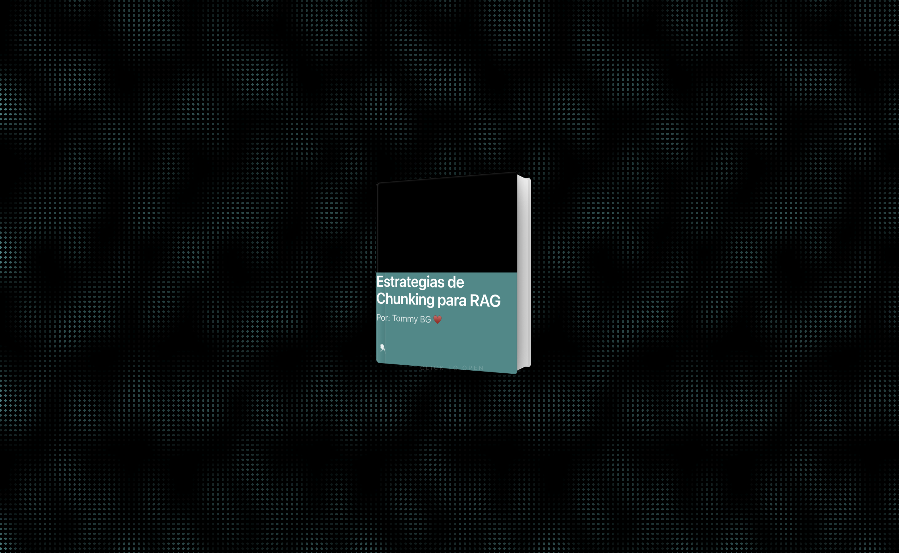
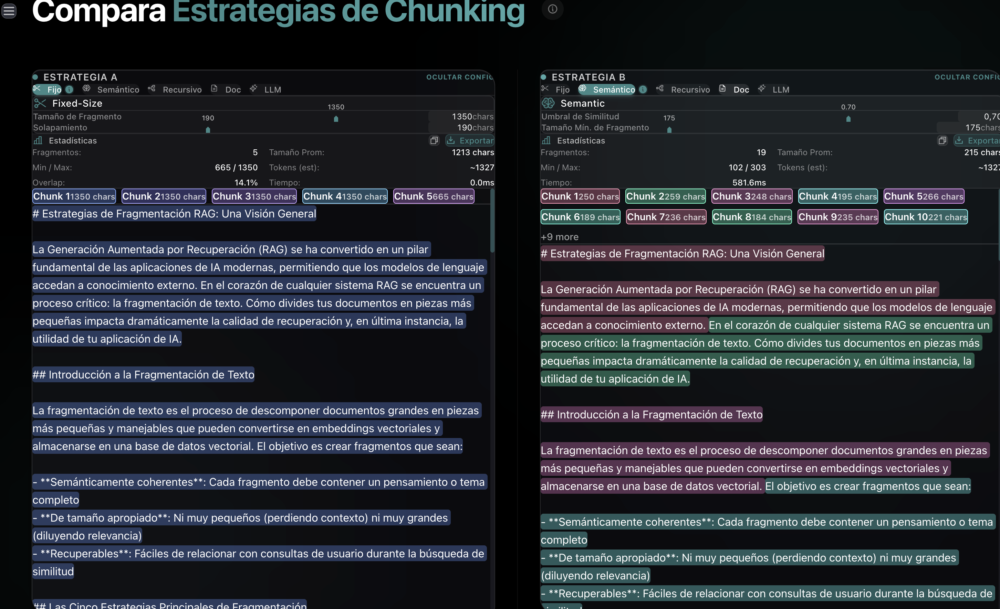
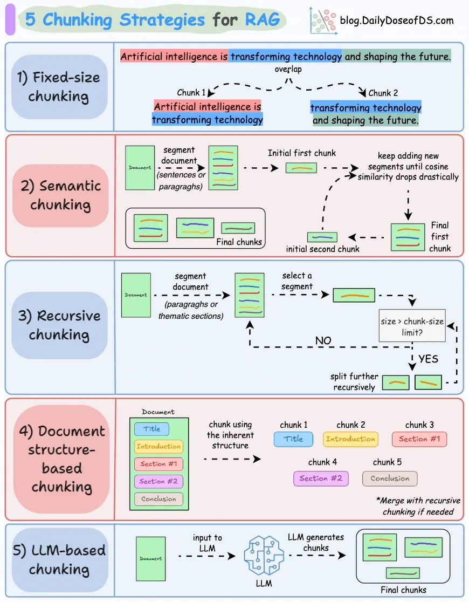

# 📚 RAG Chunking Visualizer

¡Bienvenido al **RAG Chunking Visualizer**! Esta herramienta premium está diseñada para ayudar a desarrolladores y entusiastas de la IA a entender y comparar cómo diferentes estrategias de fragmentación (chunking) afectan la segmentación de documentos para sistemas de RAG (Retrieval-Augmented Generation).



## ✨ Características

- **Visualización en Tiempo Real**: Observa cómo se divide el texto instantáneamente mientras ajustas los parámetros.
- **Comparación Side-by-Side**: Compara dos estrategias diferentes lado a lado para ver cuál se adapta mejor a tus necesidades.
- **Múltiples Estrategias**:
  - **Fixed-Size**: Fragmentos de tamaño constante con superposición ajustable.
  - **Recursive**: División inteligente basada en separadores naturales (párrafos, oraciones).
  - **Document Structure**: Respeta la jerarquía del documento (Markdown, secciones).
  - **Semantic**: Utiliza embeddings para agrupar contenido temáticamente similar.
  - **LLM-Based**: Refinamiento semántico avanzado potenciado por modelos de lenguaje.
- **Interfaz Premium**: Diseño moderno con efectos de glassmorphism, animaciones fluidas y una experiencia de usuario excepcional.



## 🚀 Cómo empezar

### Requisitos Previos

- [Bun](https://bun.sh/) (recomendado) o Node.js
- Una API Key de OpenAI (para las estrategias Semantic y LLM-based)

### Instalación

1. Clona el repositorio:
   ```bash
   git clone https://github.com/tu-usuario/chunking-strats-in-action.git
   cd chunking-strats-in-action
   ```

2. Instala las dependencias:
   ```bash
   bun install
   ```

3. Configura las variables de entorno:
   Crea un archivo `.env` en la raíz con tu API Key:
   ```env
   NEXT_PUBLIC_OPENAI_API_KEY=tu_api_key_aqui
   ```

4. Inicia el servidor de desarrollo:
   ```bash
   bun run dev
   ```

5. Abre [http://localhost:3000](http://localhost:3000) en tu navegador.

## 📖 Referencias y Aprendizaje

Este proyecto fue inspirado y utiliza conceptos detallados en **Daily Dose of DS**. Si quieres profundizar en las matemáticas y la lógica detrás de estas estrategias, te recomendamos encarecidamente este recurso:

[](https://www.dailydoseofds.com/)

*Haz clic en la imagen superior para visitar el artículo original y aprender más sobre estrategias de segmentación.*

---

Desarrollado con ♥️ por [Tommy BG](https://github.com/tommygoat)
